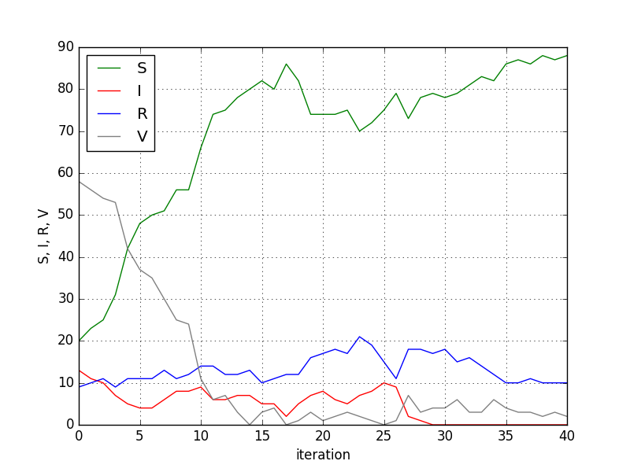

# SIRS-model
SIRS-model with dynamic regulation of the population. 
A model of infection spread in the form of a lattice of stochastic cellular automata which
can demonstrate nontrivial oscillating regimes; investigation of its dynamics and comparison with the mean-field model. 
https://doi.org/10.18500/0869-6632-2019-27-2-5-20

